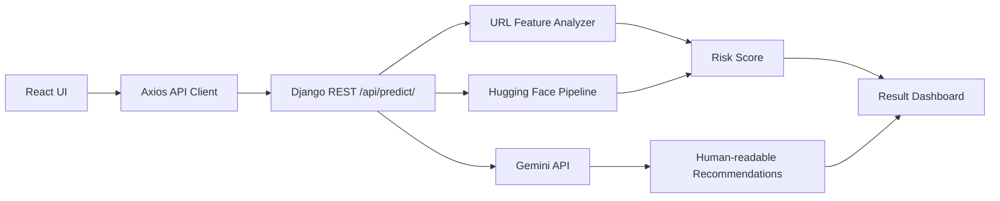

# SentinelURL - Intelligent Phishing URL Detection

SentinelURL is a full-stack AI phishing URL detection website built with React.js and Django REST Framework. It analyzes URLs with a Hugging Face transformer model, enriches the result with Gemini-generated security guidance, and presents the outcome in a polished cybersecurity dashboard.

## Architecture



## Features

- Modern responsive UI inspired by Microsoft Defender, Google Safe Browsing, and VirusTotal.
- URL validation, loading states, duplicate request prevention, and accessible forms.
- Hugging Face transformer inference loaded once at backend startup.
- Gemini API integration for explanation, recommendations, precautions, and safety tips.
- Local heuristic fallback when AI services or API keys are unavailable.
- Risk meter, threat cards, suspicious keyword analysis, and URL complexity checks.
- Detection history, search, bookmark, copy result, PDF-style printable report, and share support.
- Dark/light theme support with glassmorphism, motion, charts, and responsive layouts.

## Project Structure

```text
backend/
  api/
  detector/
  phishing_backend/
  media/
  static/
  requirements.txt
  .env.example
frontend/
  src/
    animations/
    assets/
    components/
    context/
    hooks/
    pages/
    services/
    utils/
```

## Requirements

- Python 3.10+
- Node.js 18+
- Gemini API key from Google AI Studio
- Optional: internet access on first backend startup to download the Hugging Face model

## Environment Variables

Copy `backend/.env.example` to `backend/.env`:

```env
SECRET_KEY=replace-me
DEBUG=True
ALLOWED_HOSTS=localhost,127.0.0.1
CORS_ALLOWED_ORIGINS=http://localhost:5173,http://127.0.0.1:5173
GEMINI_API_KEY=your-gemini-api-key
HF_MODEL_NAME=ealvaradob/bert-finetuned-phishing
```

Copy `frontend/.env.example` to `frontend/.env`:

```env
VITE_API_BASE_URL=http://127.0.0.1:8000/api
```

## Run Backend

```bash
cd backend
python -m venv .venv
.venv\Scripts\activate
pip install -r requirements.txt
python manage.py migrate
python manage.py runserver
```

## Run Frontend

```bash
cd frontend
npm install
npm run dev
```

Open `http://localhost:5173`.

## API Documentation

### `POST /api/predict/`

Request:

```json
{
  "url": "https://paypal-login-secure.com"
}
```

Response:

```json
{
  "prediction": "Phishing",
  "confidence": 98.23,
  "risk": "High",
  "risk_score": 86,
  "threat_category": "Credential Harvesting",
  "features": {
    "domain": "paypal-login-secure.com",
    "ssl_status": "Uses HTTPS",
    "domain_length": 24,
    "special_characters": 3,
    "url_complexity": "Medium",
    "suspicious_keywords": ["login", "secure"]
  },
  "gemini": {
    "summary": "This URL uses brand-like wording and urgency cues that are common in phishing.",
    "recommendations": ["Do not enter credentials.", "Verify the domain from the official website."],
    "precautions": ["Enable MFA.", "Report the URL to your security team."],
    "safety_tips": ["Check HTTPS and the exact domain spelling."]
  }
}
```

## Future Scope

- JWT authentication and server-side user history.
- Admin dashboard for aggregate threat intelligence.
- VirusTotal and Safe Browsing enrichment.
- PDF report generation on the backend.
- Deployment templates for Docker, Render, Railway, Vercel, and Fly.io.

